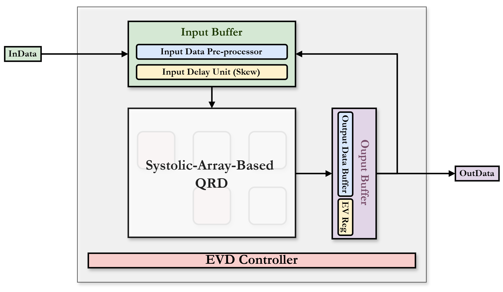
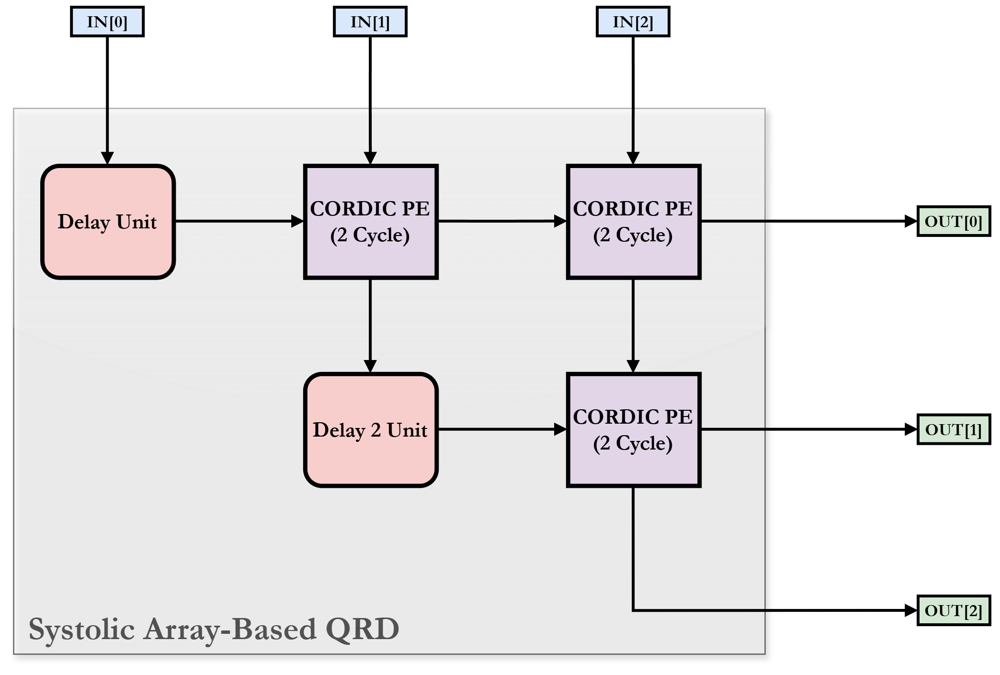
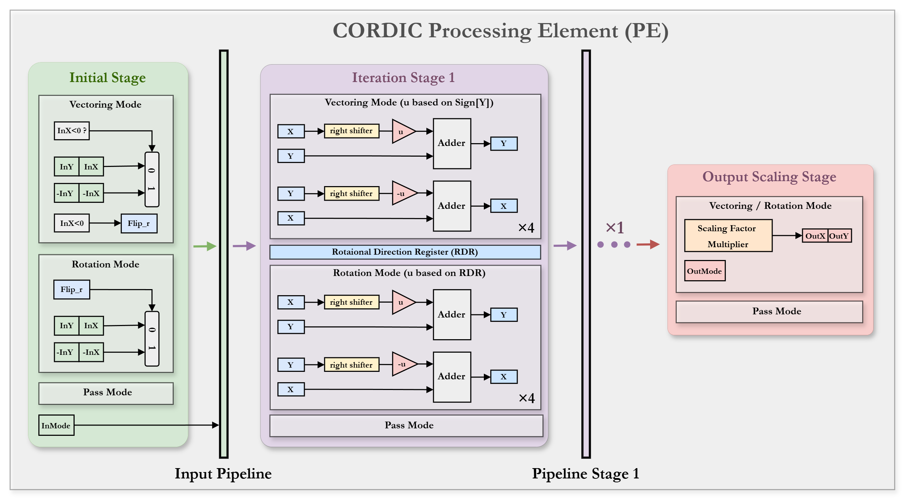

# Eigen-Value Decomposition (EVD) Hardware

A VLSI implementation of **Eigen-Value Decomposition for 3×3 symmetric matrices**,
using the iterative QR algorithm (Givens rotations) computed by CORDIC processing
elements arranged as a systolic array, synthesized on TSMC 16nm.

> NTU "DSP in VLSI" (ICDA5003), 2026 Spring — Final Project.

## Key Features

- **Iterative QR-based EVD** — repeated QR decomposition converges the diagonal to
  the eigenvalues while accumulating the eigenvector matrix.
- **Angle-free CORDIC PEs** — Vectoring mode records rotation directions, Rotation
  mode replays them; no arctan ROM required.
- **Systolic-array QR decomposition** — pipelined CORDIC PEs with delay/bypass units.
- **Synthesized on TSMC 16nm** with an optimized area-time product.

## Architecture

| Module | File | Role |
|--------|------|------|
| `EVD` | [src/01_RTL/EVD.sv](src/01_RTL/EVD.sv) | Top module. 3-state FSM (IDLE / PROCESS / OUT), iteration and I/O control. |
| `QRD` | [src/01_RTL/QRD.sv](src/01_RTL/QRD.sv) | QR decomposition systolic array (3 CORDIC PEs + delay units). |
| `CORDIC_PE` | [src/01_RTL/CORDIC_PE.sv](src/01_RTL/CORDIC_PE.sv) | CORDIC processing element (Vectoring / Rotation modes, 8 stages). |

| Top-level (EVD) | Systolic-array QRD |
|:---:|:---:|
|  |  |

**CORDIC PE**



## Specifications

| Item | Value |
|------|-------|
| Matrix size | 3×3 symmetric |
| Data format | 17-bit signed (1 sign / 5 integer / 11 fraction) |
| QR iterations | 7 |
| CORDIC stages | 8 (2 pipeline stages) |
| Total latency | 112 cycles |
| Best synthesis | ~0.92 ns clock, ~5078 µm² (TSMC 16nm) |

## I/O Interface

| Signal | Dir | Description |
|--------|-----|-------------|
| `clk`, `rst_n` | in | Clock and active-low reset |
| `InValid` | in | Asserted while input is fed |
| `InData[0:2]` | in | 17-bit signed; matrix loaded column-by-column over 3 cycles |
| `OutData[0:2]` | out | Eigenvalues / eigenvector columns |
| `OutValid` | out | Asserted while output is valid |

## Repository Structure

```
src/
├── 00_TESTBED/    # Testbench + golden test data (.dat)
├── 01_RTL/        # RTL sources: EVD.sv, QRD.sv, CORDIC_PE.sv, define.vh
├── 02_SYN/        # Synthesis (Design Compiler, syn16.tcl)
└── 03_GATESIM/    # Gate-level simulation
report/            # LaTeX technical report + figures
spec/              # Project specification (PDF)
```

## How to Run

```bash
# 1. RTL simulation
cd src/01_RTL && ./01_run        # vcs -full64 -debug_access+all -R +v2k -f file.f

# 2. Logic synthesis (TSMC 16nm)
cd src/02_SYN && ./02_run        # dc_shell -f syn16.tcl | tee syn.log

# 3. Gate-level simulation
cd src/03_GATESIM && ./03_run    # vcs ... +define+GATE_SIM
```

## Tools

SystemVerilog · Synopsys VCS + Verdi · Synopsys Design Compiler